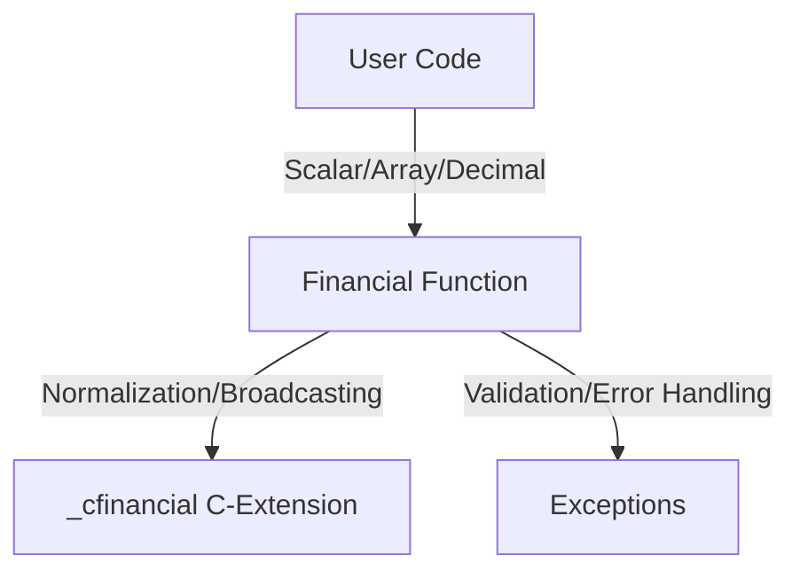

The `numpy-financial` library (importable as `numpy_financial`) provides a collection of elementary financial functions designed as a standalone replacement for the deprecated financial routines previously included in NumPy.

## Design Philosophy

The library is designed with two primary objectives:
1. **Spreadsheet Compatibility**: The functions are modeled after common spreadsheet financial formulas (e.g., those found in Excel or Google Sheets), ensuring that the API is intuitive for users familiar with traditional financial modeling.
2. **NumPy Integration**: The functions are implemented to behave like universal functions (ufuncs), supporting NumPy's core strengths: broadcasting, vectorized operations, and efficient handling of multi-dimensional arrays.

## Core Financial Functions

The library exports the following primary financial functions, categorized by their domain:

### Time Value of Money (TVM)
These functions relate present values, future values, and periodic payments over a series of periods:
*   **`fv(rate, nper, pmt, pv, when='end')`**: Calculates the future value of an investment.
*   **`pv(rate, nper, pmt, fv=0, when='end')`**: Calculates the present value of an investment.
*   **`pmt(rate, nper, pv, fv=0, when='end')`**: Calculates the periodic payment against a loan or investment.
*   **`nper(rate, pmt, pv, fv=0, when='end')`**: Calculates the number of periods for an investment.
*   **`rate(nper, pmt, pv, fv, when='end', ...)`**: Calculates the periodic interest rate using iterative methods (Newton's method).

### Amortization
These functions calculate the breakdown of periodic payments for loans:
*   **`ipmt(rate, per, nper, pv, fv=0, when='end')`**: Calculates the interest portion of a payment for a given period.
*   **`ppmt(rate, per, nper, pv, fv=0, when='end')`**: Calculates the principal portion of a payment for a given period.

### Cash Flow Analysis
These functions evaluate the profitability or return of irregular cash flow series:
*   **`npv(rate, values)`**: Calculates the net present value of a cash flow series.
*   **`irr(values)`**: Calculates the internal rate of return for a series of cash flows.
*   **`mirr(values, finance_rate, reinvest_rate)`**: Calculates the modified internal rate of return.
*   **`simple_interest(principal, rate, time)`**: Calculates simple interest.

## Data Input and Vectorization

`numpy-financial` functions are engineered for flexibility in how they handle numeric data:

*   **Input Types**: The functions support scalars, NumPy arrays, and `decimal.Decimal` objects, enabling high-precision and vectorized calculations.
*   **Vectorization and Broadcasting**: Functions leverage NumPy's broadcasting rules. When input parameters have compatible shapes, the library automatically expands them, allowing for efficient combinations of scalars and multi-dimensional arrays. Many core computations are delegated to internal C-extensions (e.g., `_cfinancial`) for performance.
*   **`when` argument**: Payments are generally defined by a `when` parameter (where `'end'`=0, `'begin'`=1). The functions handle various representations (strings, integers, or sequences) via internal normalization.

## Invariants and Failure Semantics

*   **Iteration Limits**: Functions that solve for roots (like `rate` or `irr`) rely on numerical methods and may fail if convergence is not reached within `maxiter` iterations, raising `IterationsExceededError` or returning `NaN`.
*   **No Solution**: In cases where no real solution exists for the requested financial calculation, the library may raise `NoRealSolutionError`.
*   **Array Handling**: The functions follow standard ufunc-like conventions: if all inputs are scalar, the output is scalar; if any input is an array, the output is an array of the broadcasted shape.
