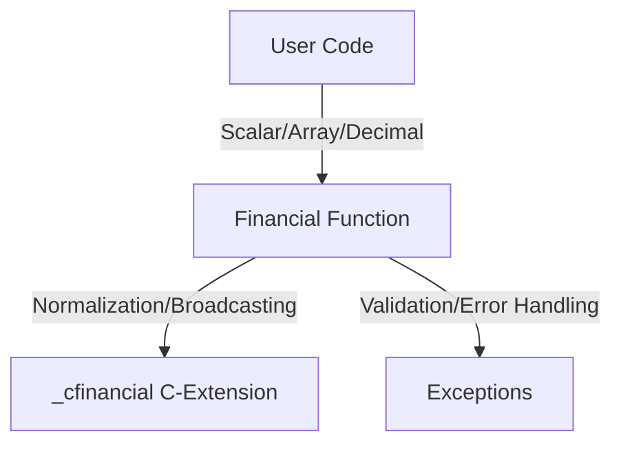

The `numpy-financial` library (importable as `numpy_financial`) provides a collection of elementary financial functions designed as a standalone replacement for the deprecated financial routines previously included in NumPy.

## Design Philosophy

The library is designed with two primary objectives:
1. **Spreadsheet Compatibility**: The functions are modeled after common spreadsheet financial formulas (e.g., those found in Excel or Google Sheets), ensuring that the API is intuitive for users familiar with traditional financial modeling.
2. **NumPy Integration**: The functions are implemented to behave like universal functions (ufuncs), supporting NumPy's core strengths: broadcasting, vectorized operations, and efficient handling of multi-dimensional arrays.

## Core Financial Functions

The library exports a primary set of financial functions exposed in `_financial.py`, including `fv`, `pv`, `pmt`, `nper`, `rate`, `ipmt`, `ppmt`, `npv`, `irr`, `mirr`, and `simple_interest`.

### Time Value of Money (TVM)
These functions relate present values, future values, and periodic payments over a series of periods:
*   **`fv(rate, nper, pmt, pv, when='end')`**: Calculates the future value of an investment.
*   **`pv(rate, nper, pmt, fv=0, when='end')`**: Calculates the present value of an investment.
*   **`pmt(rate, nper, pv, fv=0, when='end')`**: Calculates the periodic payment against a loan or investment.
*   **`nper(rate, pmt, pv, fv=0, when='end')`**: Calculates the number of periods for an investment.
*   **`rate(nper, pmt, pv, fv, when='end', ...)`**: Calculates the periodic interest rate using iterative methods.

### Amortization
*   **`ipmt(rate, per, nper, pv, fv=0, when='end')`**: Calculates the interest portion of a payment.
*   **`ppmt(rate, per, nper, pv, fv=0, when='end')`**: Calculates the principal portion of a payment.

### Cash Flow Analysis
*   **`npv(rate, values)`**: Net present value.
*   **`irr(values)`**: Internal rate of return.
*   **`mirr(values, finance_rate, reinvest_rate)`**: Modified internal rate of return.
*   **`simple_interest(principal, rate, time)`**: Simple interest.

## Implementation and Design

*   **Logic and C-Extensions**: While `_financial.py` handles high-level input normalization, shape management, and broadcasting, performance-critical loops and numerical solving routines are offloaded to the `_cfinancial.pyx` Cython extension.
*   **Vectorization and Broadcasting**: The library uses `numpy.broadcast_arrays` to handle inputs of varying shapes, ensuring functions behave like ufuncs. This allows for high-efficiency processing of multi-dimensional financial data.
*   **Data Types**: The API supports standard scalar types, NumPy arrays, and `decimal.Decimal` objects (where noted), facilitating high-precision calculations alongside vectorized NumPy operations.
*   **Error Handling**: The library implements custom exception handling for mathematical failures:
    *   `IterationsExceededError`: Raised when iterative methods (e.g., `rate` or `irr`) fail to converge.
    *   `NoRealSolutionError`: Raised when a problem has no viable real-numbered solution.
